# A.R.I.A. (Aria) - Your AI Research Assistant

[](https://github.com/lifan0127/ai-research-assistant/blob/master/LICENSE)
[](https://github.com/windingwind/zotero-plugin-template)

Aria is a Zotero plugin powered by Large Language Models (LLMs). A-R-I-A is the acronym of "AI Research Assistant" in reverse order.

This branch is developed based on [_A.R.I.A. (Aria) - Your AI Research Assistant_](https://github.com/lifan0127/ai-research-assistant) By [_lifan0127_](https://github.com/lifan0127)

## Build the project
Here is an example on how to build this project. For more information on how to build, please visit this project: [https://github.com/windingwind/zotero-plugin-template](https://github.com/windingwind/zotero-plugin-template)


For Zotero 7
```bash
git clone -b zotero-7 https://github.com/zhiruiw1/ai-research-assistant/
```
Go to the directory and build the project
```bash
cd zotero-gpt
npm install
npm run build
```

## Installation

The generated `.xpi` file in the build directory is the extension that you can install in Zotero.

#### Go to 'Tool' tab
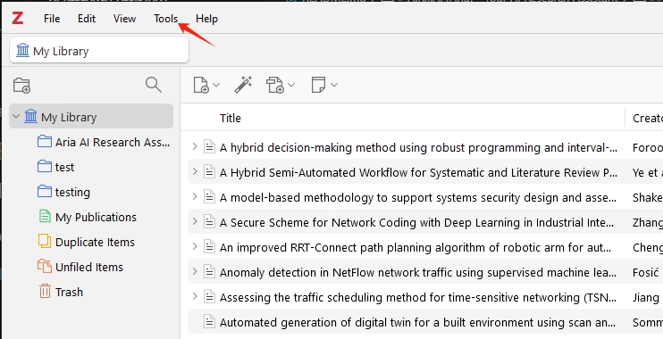

#### Select 'Plugin' tab
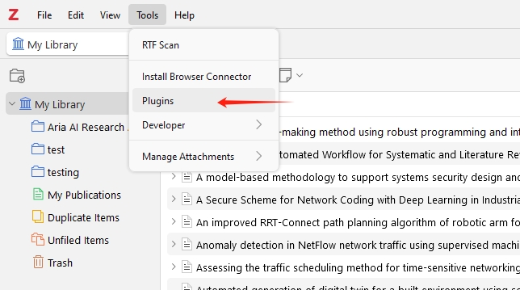

#### Click on 'Setting'
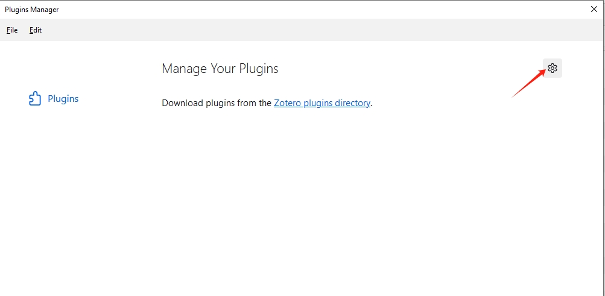

#### Select 'Install Plugin From File...'
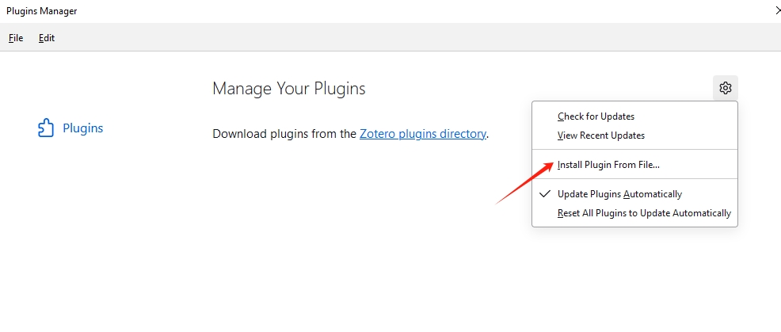

#### Allocate 'build' folder
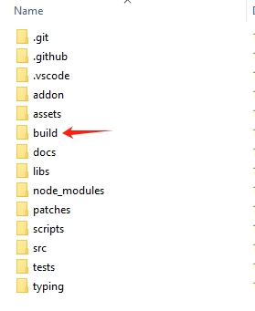

#### Select 'aria.xpi' file
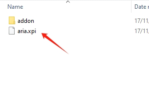

#### Plugin installed
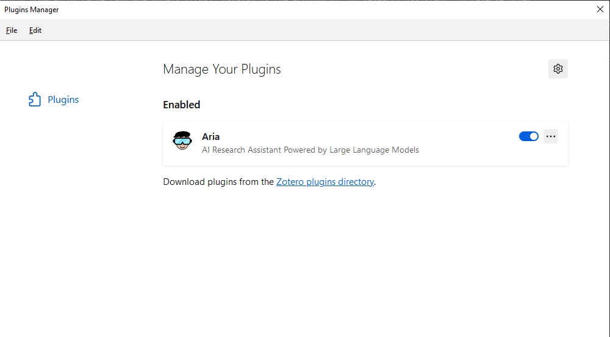

## Quickstart

### Use Drag-and-Drop to Reference Your Zotero Items and Collections


## Added Feature

### Exporting CSV file for JSON prompt answer

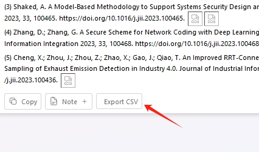

#### Provide a JSON prompt


#### Save to local file path

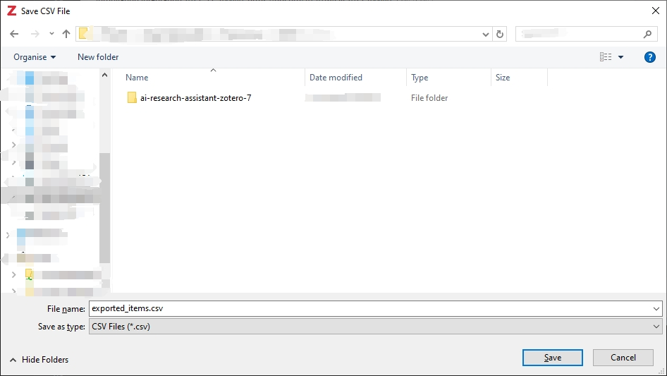

### Output CSV file
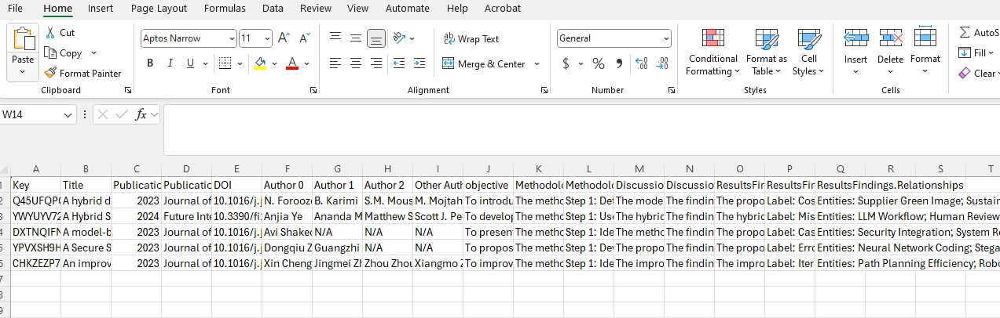


## Zotero and GPT Requirements

- Currently, only Zotero 7 is supported.
- Aria requires the OpenAI GPT-4 model family. ([how can I access GPT-4?](https://help.openai.com/en/articles/7102672-how-can-i-access-gpt-4))

## Preferences

Aria is configurable through Edit > Preferences > Aria. Please note that some changes require Zotero restart.

- __OpenAI API__: Set OpenAI api key and base URL
- __Model Selection__: Choose between the base GPT-4 model and the new GPT-4 Turbo model (Preview).
- __OpenAI Configurations__: Set the temperature and top_p value.
- __Zoom Level__: Adjust the zoom level to fit your screen resolution 
- __Keyboard shortcut__: Change the keyboard shortcut combination to better fit your workflow.

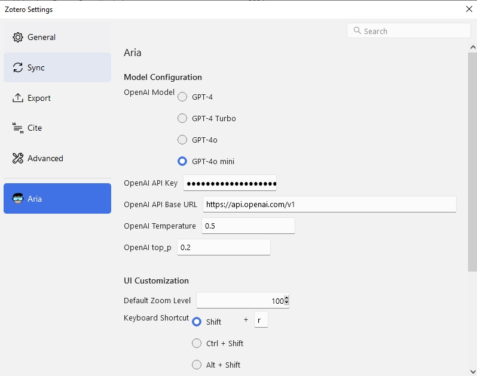

## Development

Refer to the [Zotero Plugin Development](https://www.zotero.org/support/dev/client_coding/plugin_development) guide to find instructions on how to setup the plugin in your local environment.


